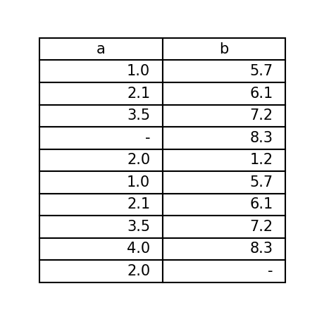
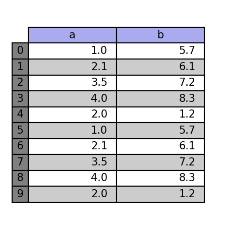

# pyTable
 
 
 

pyTable is the library to plot table easily!  
(on matplotlib)

## installation
```shell script
$ pip install pytab
```

## How to use?
### Example / [table_0.py](examples/table_0.py)
You can plot a table easily by giving data as a dict object as below.
```python
import pytab as pt


if __name__ == '__main__':
    data = {
        'a': [1.0, 2.1, 3.5, '-', 2.0, 1.0, 2.1, 3.5, 4.0, 2.0, ],
        'b': [5.7, 6.1, 7.2, 8.3, 1.2, 5.7, 6.1, 7.2, 8.3, '-', ],
        }

    # The simplest table
    pt.table(data=data)

    pt.show()
```


### Example / [table_1.py](examples/table_1.py)
And, you can design a table easily.
```python
import pytab as pt


if __name__ == '__main__':
    data = {
        'a': [1.0, 2.1, 3.5, 4.0, 2.0, 1.0, 2.1, 3.5, 4.0, 2.0, ],
        'b': [5.7, 6.1, 7.2, 8.3, 1.2, 5.7, 6.1, 7.2, 8.3, 1.2, ],
        }

    rows = [str(i) for i in range(len(data['a']))]

    pt.table(data=data,
             rows=rows,  # set numbers as row
             th_c='#aaaaee',  # set table header background-color
             td_c='gray',     # set table data (rows) background-color
             table_type='striped',  # set table type as 'striped'
             )

    pt.show()
```


## LICENSE
[MIT](LICENSE.txt)  
Copyright (c) 2020 HiroshiARAKI All Rights Reserved.